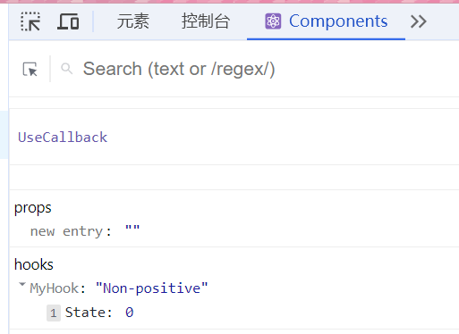
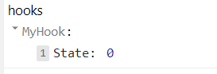

# useDebugValue

`useDebugValue(value, format?)`

用于在 [React 开发工具](https://zh-hans.react.dev/learn/react-developer-tools) 中为自定义 Hook 添加标签。

## 引入

```js
import { useDebugValue } from 'react';
```

## 参考

在你的 [自定义 Hook](https://zh-hans.react.dev/learn/reusing-logic-with-custom-hooks) 的顶层调用 `useDebugValue`，以显示可读的调试值：

### 参数 

- `value`：在 React 开发工具中显示的值。可以是任何类型。
- **可选** `format`：接受一个格式化函数。当组件被检查时，React 开发工具将用 `value` 作为参数来调用格式化函数，然后显示返回的格式化值（可以是任何类型）。如果不指定格式化函数，则会显示 `value`。

### 返回值 

`useDebugValue` 没有返回值。

## 用法 

### 为自定义 Hook 添加标签 

在 [自定义 Hook](https://zh-hans.react.dev/learn/reusing-logic-with-custom-hooks) 中调用 `useDebugValue`，可以让 [React 开发工具](https://zh-hans.react.dev/learn/react-developer-tools) 显示可读的 调试值。

```js
function useMyHook() {
  const [state] = useState(0);
  useDebugValue(state > 0 ? 'Positive' : 'Non-positive');
  return state;
}


export default function UseCallback () {

  useMyHook();
  
  // ...
```



> 不使用`useDebugValue`时，效果如下：
>
> 

> <success icon='file -exception'>注意</success>
>
> 不必为每个自定义 Hook 添加调试值。
>
> 这对于那些作为共享库一部分、具有复杂的内部数据结构并且难以检查的自定义 Hook 更有价值。

### 延迟格式化调试值 

可以将一个格式化函数作为 `useDebugValue` 的第二个参数传入：

```js
useDebugValue(date, date => date.toDateString());
```

格式化函数将接收 调试值 作为参数，返回 格式化后的显示值。

只有当组件被检查时，React 开发工具才会调用此函数并显示其返回值。

使用格式化函数，可以避免在组件没有被检查时，运行可能开销较大的格式化逻辑。例如，如果 `date` 是一个日期值，则可以避免在每次渲染时都调用 `toDateString()` 方法。